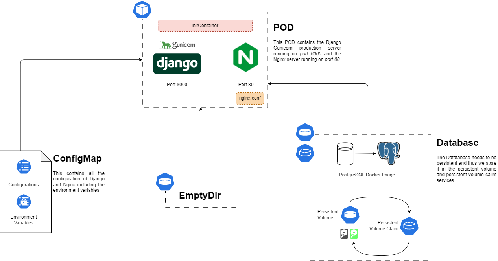

# Kubernetes Deployment of Application <!-- omit in toc -->

---

# Contents <!-- omit in toc -->

- [1. Project Structure](#1-project-structure)
- [2. Deploying application to Minikube](#2-deploying-application-to-minikube)
  - [2.1. Prerequisites](#21-prerequisites)
  - [2.2. Steps to Deploy on Minikube](#22-steps-to-deploy-on-minikube)
    - [2.2.1. Start the Minikube cluster](#221-start-the-minikube-cluster)
    - [2.2.2. Build images using Minikube docker env](#222-build-images-using-minikube-docker-env)
    - [2.2.3. Database Deployment](#223-database-deployment)
    - [2.2.4. Application Deployment](#224-application-deployment)
    - [2.2.5. Port Forwarding](#225-port-forwarding)

---

## 1. Project Structure



## 2. Deploying application to Minikube

### 2.1. Prerequisites

- You must have Docker installed
- You must have the Kubernetes extension installed on the Docker desktop
- You must have the Minikube CLI installed
- You must have the KubeCTL CLI installed

<div style="background-color: #CCFFFF; padding:10px; border-radius:10px;font-size:0.8em; margin-bottom:10px">
  <span style="color: #5F9EA0">💡Note: </span>
  <span style="color: #666666">Minikube uses its own docker engine to run images, thus in order to run the local docker images we either have to upload them to docker hub or enable the Minikube docker engine</span>
</div>

### 2.2. Steps to Deploy on Minikube

#### 2.2.1. Start the Minikube cluster

- Open the command prompt and run the command below to start the minikube cluster

```bash
minikube start
```


- Now, run the command below to open the dashboard

```bash
minikube dashboard
```

#### 2.2.2. Build images using Minikube docker env

- To enable the Minikube docker engine run the command below

```bash
minikube docker-env | Invoke-Expression
```

- Build the current projects docker image using

```bash
docker compose build
```


#### 2.2.3. Database Deployment

- Now, apply the database secrets and persistent volumes using the command

```bash
kubectl apply -f ./db/secret.yaml
kubectl apply -f ./db/storage.yaml
```


- Now, deploy the database using the command

```bash
kubectl apply -f ./db/deployment.yml
```


- Check the status of the deployment using the command

```bash
kubectl get pods
```


- Now, deploy the database service using the command and get the database local IP and Port

```bash
kubectl apply -f ./db/service.yaml
kubectl get service
```


- Now, copy the IP for the database service and put it in the application's config map

#### 2.2.4. Application Deployment

- Now that the database is deployed, we can deploy the application

- Apply all the applications secrets, configMap, Deployment and Service as previously done for the database

```bash
kubectl apply -f ./app/nginx-conf.yml && \
kubectl apply -f ./app/secret.yml && \
kubectl apply -f ./app/configmap.yml && \
kubectl apply -f ./app/deployment.yml && \
kubectl apply -f ./app/service.yml
```


- Now we will open a terminal inside the django container, to do this run the command

```bash
kubectl get pods
kubectl exec -it <pod-name> -- /bin/bash
```

- Now run the command below in order to apply migrations to the database

```bash
/opt/venv/bin/python manage.py makemigrations && \
/opt/venv/bin/python manage.py migrate
```

#### 2.2.5. Port Forwarding

- Now, in order to access the remote pod from the local machine, we will use port forwarding

```bash
kubectl port-forward service/django-service 8000:8000;
```


- Done ! Now you can access the application on http://localhost:8000


